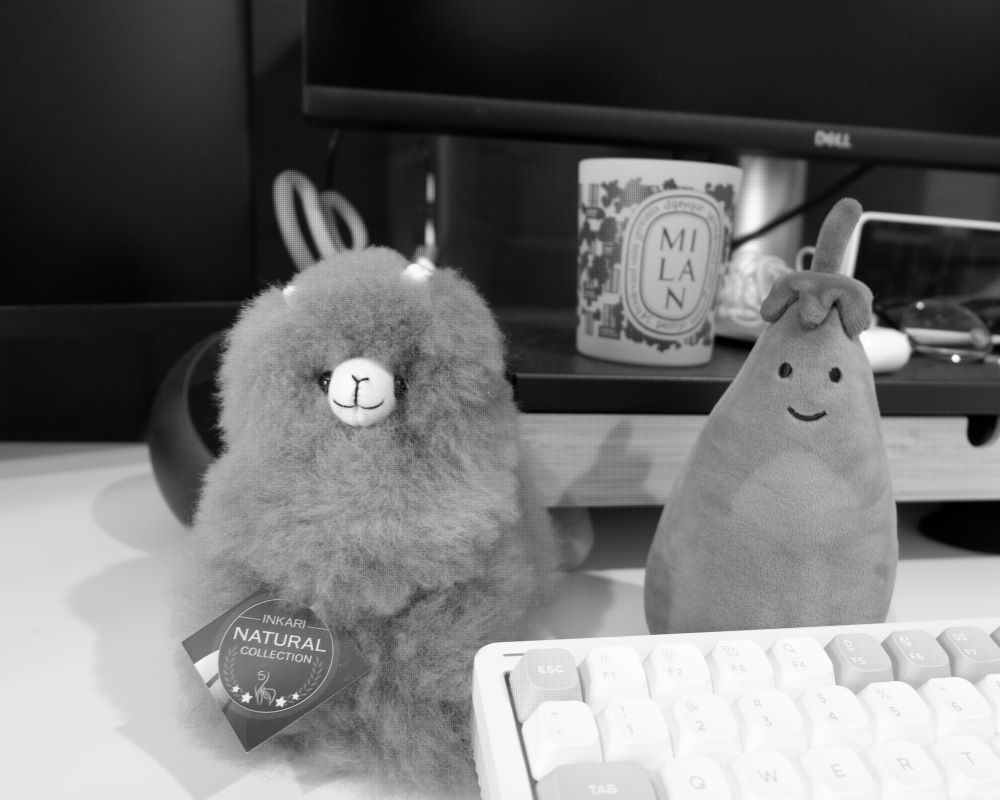
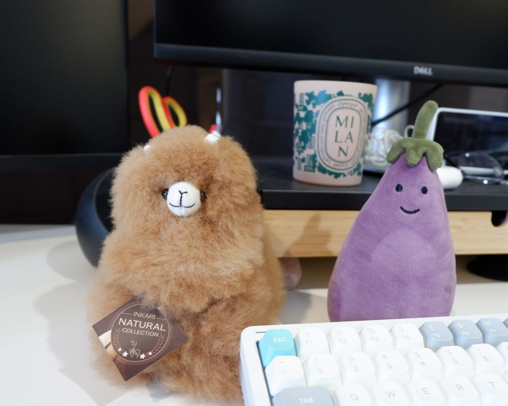
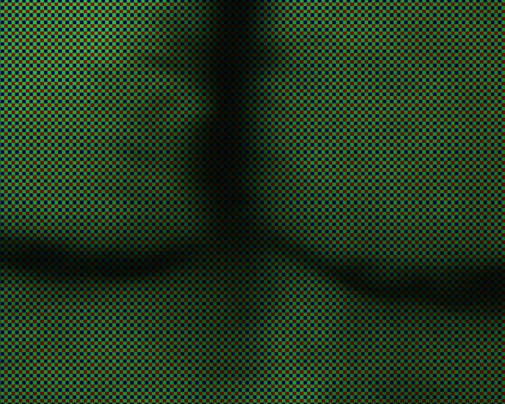
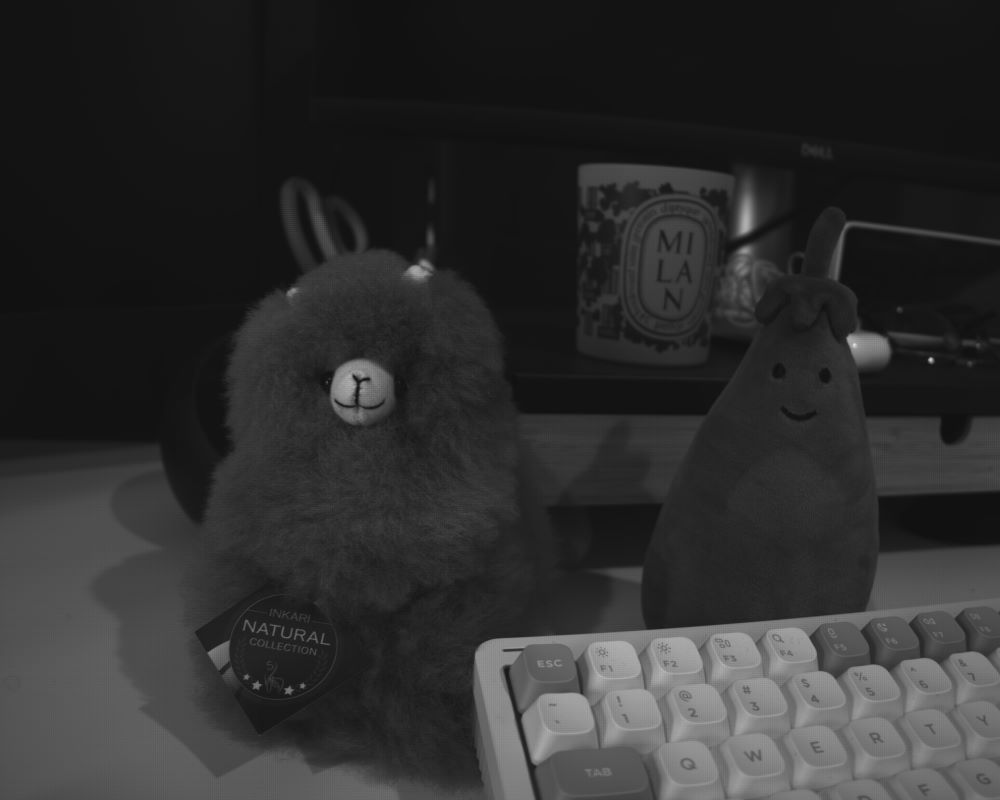
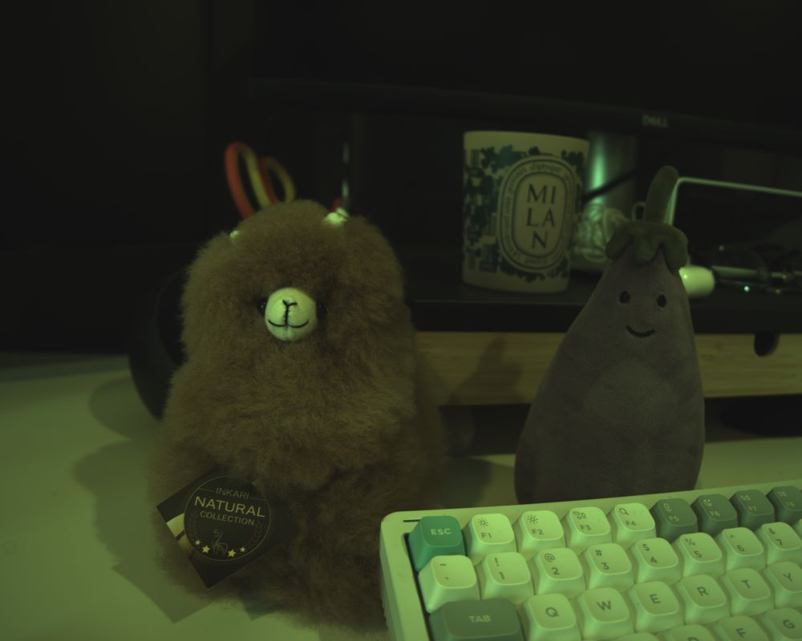

# demosaic

Demosaic real and simulated RAW images in C++ for educational purposes.

| **Simulated RAW image** | **Simulated demosaiced image** | **Zoom-in RGB mosaic** |
| --- | --- | --- |
|  |  | 


| **Real RAW image** | **Real demosaiced image** |
| --- | --- |
|  |  |

The color of demosaiced real RAW images might seem wrong because we skipped many steps in the Image Signal Processing pipeline (black level subtraction, white balance, gamma correction, etc.).

## Features

- Demosaic using OpenCV's `cvtColor`.
- Simulate RAW images from .PNG, .JPG, etc.

## Requirements

- **C++ Compiler**: A C++17-compatible compiler.
- **CMake**: Version 3.10 or higher for building the project.
- **OpenCV**: For image processing. Tested on version 4.5.4.
- **LibRaw**: For handling real RAW image files.

## Building

First, navigate to `build` and then build the project.

```bash
cd demosaic/build
cmake ..
make
```

Modify `CMakeLists.txt` accordingly if any file/library is added.

## Usage

There are three executables in `demosaic/build`.

1. `main_rawgen` is for generating a simulated RAW image from a color image (.PNG, .JPG, etc.).
2. `main_demosaic` is for demosaicing real or simulated RAW images.
3. `main_loadraw` is for loading and displaying RAW images.

Call the executables to see the required arguments. Here are some example usages. Example images are in `demosaic/data`.

**Simulating RAW image**
```bash
./main_rawgen ../data/plush.JPG ../results/plush_rggb RGGB
```

**Demosaic simulated RAW image**
```bash
./main_demosaic sim ../results/plush_rggb.raw ../results/plush_sim_demosaiced.png
```

**Demosaic real RAW image**
```bash
./main_demosaic real ../data/plush.RAF ../results/plush_real_demosaiced.png
```

**View and save real RAW as grayscale and mosaic RGB images**
```bash
./main_loadraw real ../data/plush.RAF ../results/plush_realraw
```